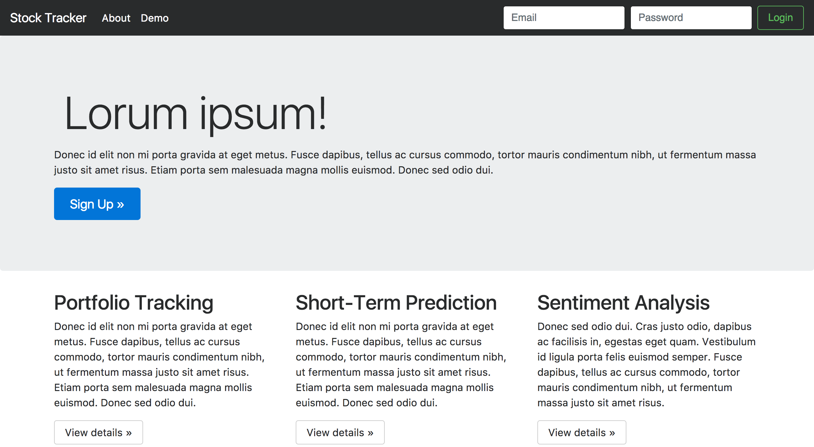
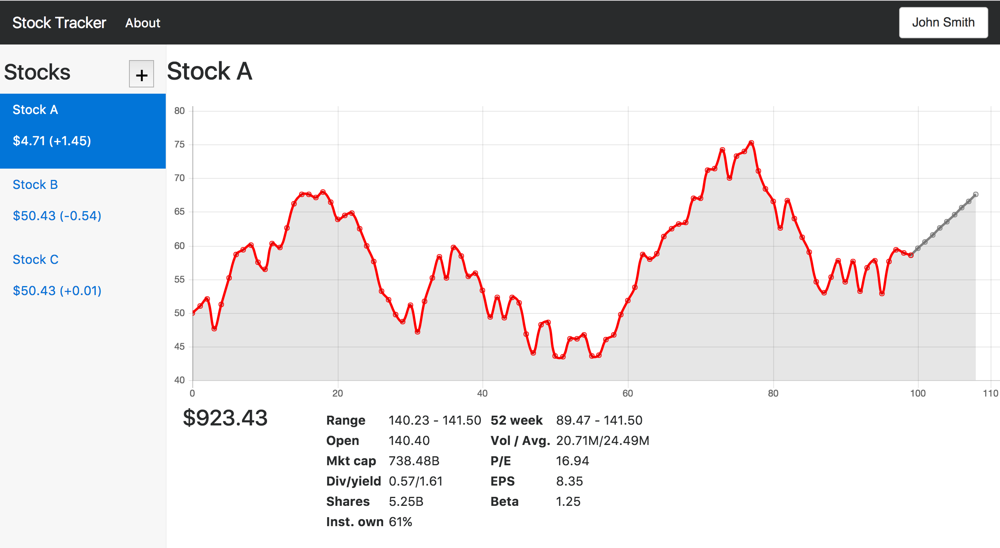

# cs0320 Term Project

**Team Members:** Kevin Jin (`kjin2`), Will Povell (`wpovell`), Matt Robins (`mrobins`), Philip Xu (`jx24`)

**Project Idea:** Stock portfolio manager that provides short-term predictions for stocks and sentiment analysis on relevant news.

**Mentor TA:** Sean Segal (`sean_segal@brown.edu`)

## Project Requirements

The main requirements for the project include:

- Frontend
- Take a portfolio of stocks and display current and historical prices via webapp
	- Allow users to create an account to save their portfolio, customize experience
	- Provide a mock free source of data (most likely not real-time)
	- Allow users to provide an api key to buy current stock data
	- Displays relevant statistics via clean UI and easy to use UX.
		- Shows real-time generated projection trajectories according to algorithms handled by the backend.
		- Shows prices via candlestick(likely D3) and company fundamentals, relevant news, and general social media sentiments.
- Backend
- Provide sentiment analysis on news articles and social medias found to be related to a given stock
	- News articles include those that mentions company or are just general news about sector
	- Twitter API will allow easy retrieval and query of relevant tweets.
- Provide a short-term prediction of how that stock will perform using neural networks.

### Input from Potential Users

Currently we are developing a survey we hope to send to the Brown Investment Group, as well as others possibly interested/involved in the stock market. The current draft of the survey can be found [here](https://docs.google.com/forms/d/e/1FAIpQLSfDgahogxEjuioWqXFXex2qrgF4Y9_TL1Xn3tD_T3l5VIli4Q/viewform?usp=sf_link).

## Project Specs and Mockup
#### Specs:
###### Interfaces:
1. Graphical User Interface:

   The user interface of this project will be a web application. The layout is demonstrated in the mockups.  
   Features:  
   1. Signup, Login and Data Retention:  
   
      Users should be able to sign up on our service using an username, password, and email.  
      Users should be able to log in to the service and create/edit their portfolio. That information should be retained and everytime the user logs in they should be able to have access to the same portfolio they created.  
      Users should also be able to log out, change their passwords, or delete their accounts.
   2. Portfolio Editting:  
   
      Users should be able to create and edit their portfolios using a search box through symbol or stock name query. There should be an extensive stock database containing all currently traded NYSE or more stocks.
   3. Stock Information Display:  
   
      When a user clicks on a stock, for example AAPL, the stock's candlestick chart, statistics, fundamentals, predictions, should be displayed. Users should be able to zoom in on the graph, mouse over for more daily information, and draw trendlines with percentage displays. The current traded price, volumes traded, volatility, and fundamentals of the company will be displayed below the graph, and a user can click to see more details. News articles or twitter feeds regarding the stock will be displayed on the right, along with a sentamental analysis of social media feeds.
###### Functionalities:
1. User Login/Signup:  
   Users should be able to sign up on our service using an username, password, and email. 
   Users should be able to log in to the service and create/edit their portfolio. That information should be retained and everytime the user logs in they should be able to have access to the same portfolio they created.  
   Users should also be able to log out, change their passwords, or delete their accounts.
2. Portfolio Management:
   Users will have access to a complete set of all stocks currently trading in the U.S.. 
   Users should be able to edit their portfolio and have access to it when they re log in.  
3. Stock:
   Users should be able to have access to all relevant stock information: Current price, fundamentals, daily open, daily close, daily high, daily low, daily volume, volatility, news articles, projections, and sentimental analysis informations.  
   Users should be able to draw trendlines, zoom onto graphs, have access to info on the graphs.
###### Performance:
Minimal computations will be performed on the frontend, most of the data manipulation and preperations will be done on the backend.  
1. User data management.  
User data will be stored in a SQL database. Insertions upon creation, and query upon login. All performance will be limited by SQL operations, which will likely O(log(n)).
2. Prediction.  
The backend will performance prediction using APIs for recurrent neural networks and sentimental analysis. The performance of this will depend on the APIs used. After the initial run the results will be cached and any redundant queries will be retrieved from the cache instead to speed up querying.
3. Stock Info Querying:  
The backend will provide information of charts and fundamentals. This information will be queried from a SQL database and cached for future uses.

###### Safety:
Our app will not have any financial transactions or irreversible actions. We will store the usernames and passwords for logins on the site in a database on the server. We will find an online package to use as a password hasher.
Compatibility:

###### Compatibility:
Our portfolio manager will be a web app that supports at least Chrome that can be accessed from personal computers. Our stretch goals include support for Firefox, Safari, IE, Edge, and smartphone browsing.

We will not require any files to be provided from the client.
#### Mockups:
###### Main page

###### Graph page

## Project Design Presentation
_A link to your design presentation/document will go here!_

## How to Build and Run
_A necessary part of any README!_
